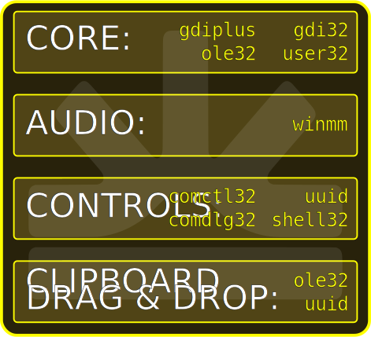

# Winsimple V1.6 API Documentation

<iframe width="560" height="315" src="https://youtube.com/embed/VVVxM9egtWc" frameborder="0" allowfullscreen></iframe>

One of the major benefits of V1.6 is that you don't have to include the entire library to use just graphics. Winsimple is divided into the following five optional headers:

* [winsimple.hpp](core.md) - The Base and Core of the Library. Other headers will likely depend on this header.

* [winsimple-animation.hpp](animation.md) - Provides two methods of animation. ws::GIF and ws::ShiftData + ws::Shift()

* [winsimple-audio.hpp](audio.md) - ws::Wav provides support for streamed audio playback of any filetype that your OS supports.

* [winsimple-clipboard.hpp](clipboard.md) - Provides a simple access method to get and set content on the system clipboard. 

* [winsimple-controls.hpp](controls.md) - The GUI controls of Winsimple that wrap around the underlying winapi.

